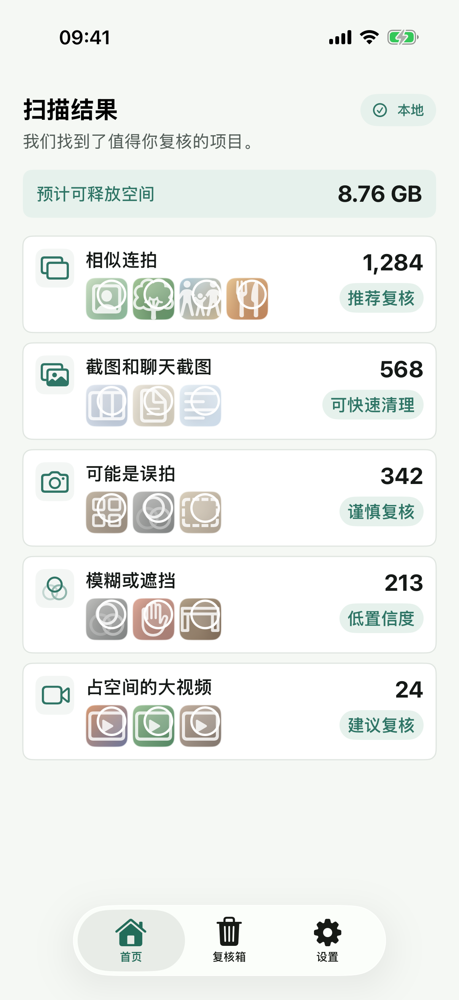
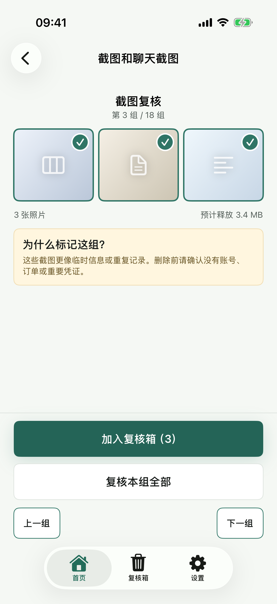
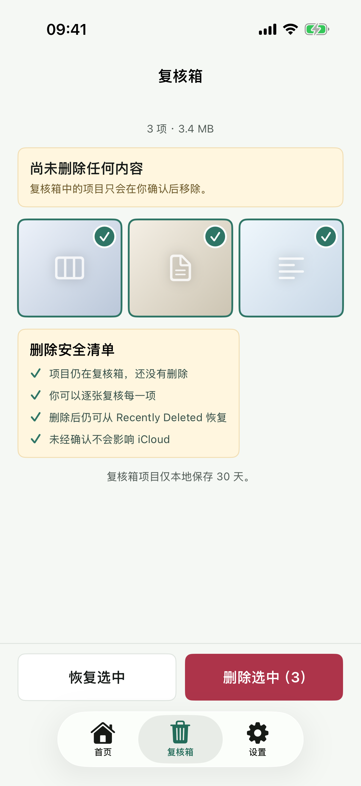

# TrueKeep / 留真

**本地 AI 相册清理，留下真正值得留的照片。**

TrueKeep 是一个原生 iOS 相册整理应用：在设备上分析照片与视频，把值得检查的内容整理成清理任务，再由你逐项决定去留。

**当前阶段：iOS MVP，支持从源码构建。** 本页展示已有实现与演示截图，分发和上架准备见[发布清单](iOS/TrueKeep/RELEASE_CHECKLIST.md)。

[产品动线](docs/09-current-product-flow-with-screenshots.md) · [运行项目](#运行项目) · [开发与验证](iOS/README.md)

## 看看它如何工作

<p>
  
  
  
</p>

*仓库现有演示截图：清理任务 → 逐组复核 → 复核箱。完整流程和截图说明见[产品动线文档](docs/09-current-product-flow-with-screenshots.md)。*

## 能做什么

- **整理截图与大视频**：扫描可访问的系统照片图库，按任务呈现候选内容。
- **辅助筛选相似、模糊和误拍照片**：使用本地视觉分析提供复核线索；这些结果是低置信度候选，需要你判断。
- **逐组查看再决定**：结合缩略图、清理理由、预计空间和推荐保留项进行复核。
- **先放入复核箱**：加入复核箱不会删除照片，可以在最终确认前移出。
- **支持有限照片权限**：仅扫描已授权内容，并提示结果可能不完整。

## 照片的去留，由你决定

1. 先解释用途与本地处理方式，再请求照片权限。
2. 扫描只生成复核候选，不自动删除。
3. 低置信度候选由用户主动选择，推荐保留项受到保护。
4. 删除前再次确认，并说明系统图库、iCloud Photos 同步及“最近删除”的影响。
5. 删除失败的项目保留状态，方便后续处理。

照片分析在设备上完成，不上传照片。使用 iCloud Photos 时，系统图库删除仍可能同步到其他设备。

## 运行项目

需要 macOS、Xcode、XcodeGen，以及支持 iOS 18.0 或更新版本的运行环境。

```bash
git clone https://github.com/qmkCamel/photo-cleaner.git
cd photo-cleaner/iOS/TrueKeep
xcodegen generate
open TrueKeep.xcodeproj
```

在 Xcode 中选择 `TrueKeep` Scheme 和可用模拟器运行。安装到自己的 iPhone 需要配置开发者签名，详见 [iOS 开发说明](iOS/README.md)。

## 技术与验证

- **Swift + SwiftUI**：原生界面与交互。
- **Photos**：图库授权、资源读取和用户确认后的删除。
- **Vision**：设备端相似度、照片美学和人脸拍摄质量分析。
- **XcodeGen**：生成工程；项目包含单元测试和 UI 自动化测试。

测试运行方式与发布检查见 [iOS README](iOS/README.md)。UI 测试默认开启删除安全锁，避免真实删除图库内容。

## 反馈

欢迎通过 [Issues](https://github.com/qmkCamel/photo-cleaner/issues) 提交体验反馈、问题或改进建议。描述复现步骤和授权状态即可；截图请使用示例照片。

<details>
<summary>English overview</summary>

TrueKeep is a native iOS photo cleanup MVP built with SwiftUI and on-device Vision analysis. It organizes screenshots, large videos, and visual review candidates into tasks you can inspect before taking action.

The flow is: explain photo access → scan locally → review candidates → add to the Review Bin → confirm deletion. Scans never delete photos automatically, and adding an item to the Review Bin does not remove it from Photos.

Photo analysis stays on the device. Deleting from the system library may still sync through iCloud Photos. Build from source with Xcode and XcodeGen; iOS 18.0 or later is required.

</details>
