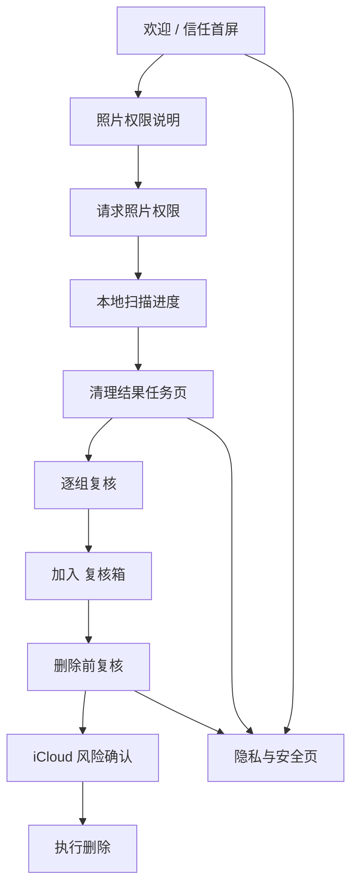

# 08 MVP 与信任验证设计稿和交互稿

## 设计目标

阶段一的目标不是最大化清理数量，而是验证两件事：

- 用户愿不愿意授权相册。
- 用户是否相信产品不会乱删家庭照片。

因此首版体验围绕“本地处理、可解释、先复核、再删除”展开。所有候选只进入复核流程，不自动删除。

## 交付物

- 高保真可点击原型：[docs/prototypes/mvp-trust-validation/index.html](./prototypes/mvp-trust-validation/index.html)
- 视觉概念参考图：[docs/design/mvp-trust-validation/assets/visual-concept.png](./design/mvp-trust-validation/assets/visual-concept.png)
- 相册缩略图素材：[docs/design/mvp-trust-validation/assets/photo-thumbnails.png](./design/mvp-trust-validation/assets/photo-thumbnails.png)

## 信息架构

MVP 信任验证包含 7 个核心界面：

1. 欢迎 / 信任首屏
2. 照片权限说明
3. 本地扫描进度
4. 清理结果任务页
5. 相似照片逐组复核
6. 复核箱 删除前复核
7. 隐私与安全页

底部 Tab 只在扫描结果之后出现：

- 首页：清理任务结果。
- 复核箱：删除前复核篮。
- 设置：隐私与安全。

## 核心流程



## 视觉系统

### 设计气质

- iOS 原生感，像家庭相册助手，不像清理大师。
- 白底、克制、安静，避免强营销和强焦虑。
- 用深绿表达可信和本地处理。
- 用浅黄表达安全提醒。
- 用红色只表达删除风险，不用于转化刺激。

### 颜色

- 页面背景：`#f5f7f4`
- 主背景：`#ffffff`
- 主文字：`#151917`
- 次级文字：`#69736f`
- 主色：`#2f7566`
- 主色深色：`#246457`
- 主色浅底：`#e6f1ec`
- 安全提醒底色：`#fff6df`
- 删除色：`#c96372`
- 边框：`#dfe5e0`

### 字体与排版

- 字体栈：`Inter, system-ui, -apple-system, SF Pro Text, PingFang SC`
- 屏幕标题：20px / 780 weight
- 正文：13px / 1.45 line-height
- 卡片标题：14px / 720 weight
- 标签：10-12px / 760 weight
- 控件文字：14px / 760 weight

### 组件原则

- 卡片圆角控制在 8px。
- 主按钮 50px 高，深绿渐变，承载前进动作。
- 次按钮白底描边，用于返回、恢复、取消。
- 删除按钮只出现在 复核箱 和最终确认弹层。
- 隐私承诺使用图标加短句，不写成长段合规文案。

## 屏幕规格

### 1. 欢迎 / 信任首屏

目标：在请求权限前建立基本信任。

核心内容：

- `TrueKeep / 留真`
- `你的回忆，只在你的设备上。`
- `100% 本地处理`
- `隐私优先`
- `删除前先复核`
- 主按钮：`继续`
- 次入口：`了解更多`

交互：

- 点击 `继续` 进入照片权限说明。
- 点击 `了解更多` 进入隐私与安全页。
- 这一屏不展示“可释放多少空间”，避免制造焦虑。

开发注意：

- 不得在首屏直接触发系统权限弹窗。
- 文案不能出现“垃圾照片”“一键清理”“手机加速”。

### 2. 照片权限说明

目标：解释为什么需要权限，再请求系统授权。

核心内容：

- `我们只需要访问你的照片和视频`
- `我们不会上传你的照片或视频`
- `扫描结果保存在此 iPhone`
- `权限可以随时更改`
- 主按钮：`允许访问照片`
- 次按钮：`暂不`

交互：

- 点击 `允许访问照片` 后，真实 App 中触发 `PHPhotoLibrary` 权限请求。
- 授权成功后进入扫描进度。
- 拒绝授权或 Limited Access 需要进入对应说明状态。

开发注意：

- 需要区分 Full Access、Limited Access、Denied。
- Limited Access 下要提示扫描覆盖不完整。
- 权限解释必须先于系统弹窗出现。

### 3. 本地扫描进度

目标：降低等待焦虑，明确扫描在设备上进行。

核心内容：

- 进度环。
- 已扫描照片 / 视频数量。
- 分任务状态：扫描照片、扫描视频、查找相似照片、检测截图、分析大视频。
- 本地扫描提示。

交互：

- 扫描完成后进入清理结果页。
- 用户可以取消或关闭 App。
- 后续真实 App 应支持暂停、恢复、后台继续。

开发注意：

- 大图库扫描要分批。
- 低电量、发热、权限不足、后台中断都要转成明确状态。
- 扫描阶段不能修改或删除系统相册内容。

### 4. 清理结果任务页

目标：把扫描结果组织成用户能理解的清理任务。

任务分类：

- 相似连拍
- 截图和聊天截图
- 可能是误拍
- 模糊或遮挡
- 占空间的大视频

每个任务卡展示：

- 候选数量。
- 缩略图预览。
- 风险/置信标签。
- 简短说明。

交互：

- 点击任务卡进入逐组复核。
- 底部 Tab 可进入 复核箱 或隐私与安全。

开发注意：

- 排序应优先安全和可解释性，而不是最大可释放空间。
- 低置信度任务用“谨慎复核”或“低置信度”，不默认选中。
- 预计节省空间必须由真实资源大小聚合。

### 5. 相似照片逐组复核

目标：让用户确认推荐保留项和候选删除项。

核心内容：

- 推荐保留照片。
- 同组候选缩略图。
- 预计释放空间。
- 标记理由。
- 主按钮：`加入 复核箱`
- 次按钮：`复核本组全部`

交互：

- 点击候选缩略图切换选中状态。
- 推荐保留项默认不选中且批量全选跳过，但用户可逐张主动选择或取消。
- 每张照片的更多操作可选择 `确认保留，不再提醒`；确认后立即移出删除选择和复核箱，并提供撤销。
- 已确认保留是用户保护状态，不等同于算法的推荐保留。后续扫描不再把它作为普通清理候选，相似组仍可把它作为只读比较参考。
- 点击 `加入 复核箱` 后进入 复核箱 或下一组。
- `上一组` / `下一组` 支持连续复核。

开发注意：

- 推荐保留项应由清晰度、主体、表情、重复度共同决定。
- 已确认保留 ID 只保存在本机；设置页支持逐项取消或全部重置。
- 低置信候选默认不选中。
- 删除理由必须可解释，不能只写“AI 判断”。

### 6. 复核箱 删除前复核

目标：作为误删风险的最后缓冲。

核心内容：

- `尚未删除任何内容`
- 已选项目网格。
- 删除安全清单。
- `恢复选中`
- `删除选中`

交互：

- 点击缩略图切换最终删除选择。
- 点击 `恢复选中` 将项目移出 复核箱。
- 点击 `删除选中` 打开 iCloud 风险确认弹层。
- 最终确认后才执行删除。

开发注意：

- 复核箱 项目只保存在本地。
- 删除前必须二次确认。
- 删除后提示 Recently Deleted 恢复窗口。
- iCloud Photos 风险不能隐藏在深层设置里。

### 7. 隐私与安全页

目标：用白话解释产品承诺和风险边界。

核心内容：

- `100% 本地处理`
- `不收集照片或视频`
- `不做跟踪`
- `由你控制`
- iCloud Photos 风险说明。
- 数据与隐私细节入口。

交互：

- 从欢迎页、结果页、底部设置 Tab 都可以进入。
- 返回上一页。
- 二级入口后续可展开为详细说明。

开发注意：

- 如果后续引入崩溃分析、订阅验证或日志上报，必须在此页披露。
- App Store 隐私标签要和此页承诺一致。

## 状态设计

首版开发至少需要覆盖这些状态：

- 首次打开。
- 权限未决定。
- 权限被拒绝。
- Limited Photos Access。
- 扫描中。
- 扫描暂停。
- 扫描失败。
- 无候选结果。
- 有候选结果。
- 低置信度候选。
- 复核箱 为空。
- 复核箱 有项目。
- 删除确认弹层。
- 删除完成。

## 开发接口建议

候选项建议抽象成统一数据结构：

```ts
type CleanupCandidate = {
  id: string
  assetId: string
  groupId?: string
  category: "similar" | "screenshot" | "accidental" | "blurry" | "largeVideo"
  confidence: "high" | "medium" | "low"
  defaultSelected: boolean
  recommendedKeep: boolean
  reason: string
  estimatedBytes: number
  localThumbnailUrl: string
}
```

任务聚合结构：

```ts
type CleanupTask = {
  id: string
  title: string
  category: CleanupCandidate["category"]
  candidateCount: number
  estimatedBytes: number
  confidenceLabel: string
  previewAssetIds: string[]
}
```

复核箱 状态：

```ts
type ReviewBinItem = {
  candidateId: string
  selectedForDelete: boolean
  addedAt: Date
}
```

## 不做事项

阶段一明确不做：

- 自动无确认删除。
- 系统缓存清理。
- 手机加速、杀毒、VPN、安全中心。
- 云端多人相册。
- 专业摄影图库管理。
- 高压订阅弹窗。

## 验收标准

这套 MVP 设计稿进入开发前，需要满足：

- 用户能在不看说明文档的情况下理解为什么要授权相册。
- 每个候选删除前都有复核机会。
- 推荐保留项和删除理由在逐组复核中可见。
- 删除前出现 iCloud Photos 风险提示。
- 文案不制造焦虑，不使用 Cleaner 品类的夸张表达。
- 隐私承诺和实际技术实现一致。
