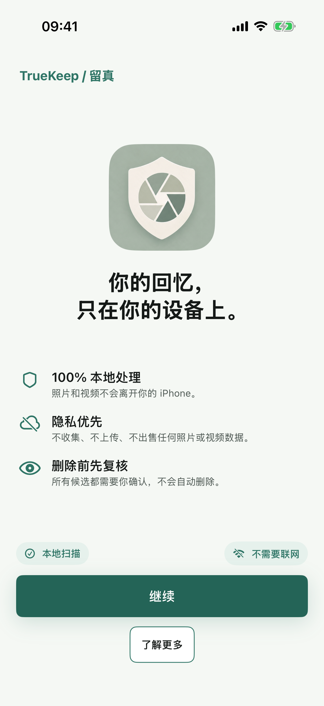
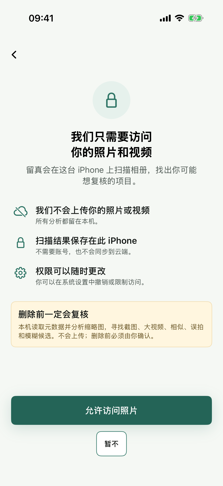
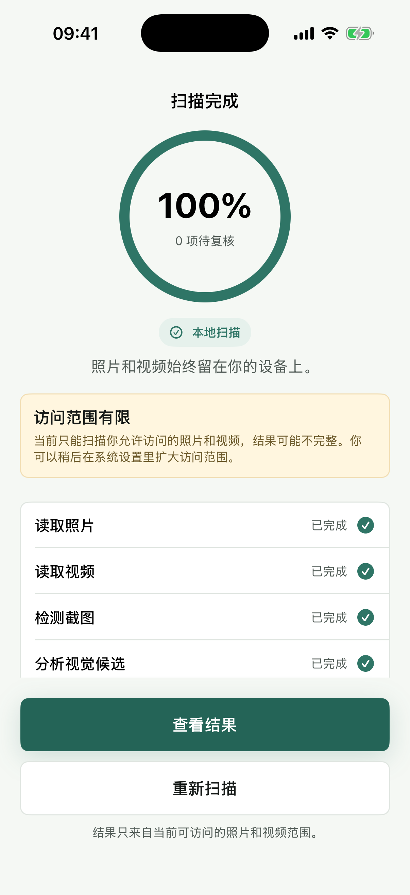
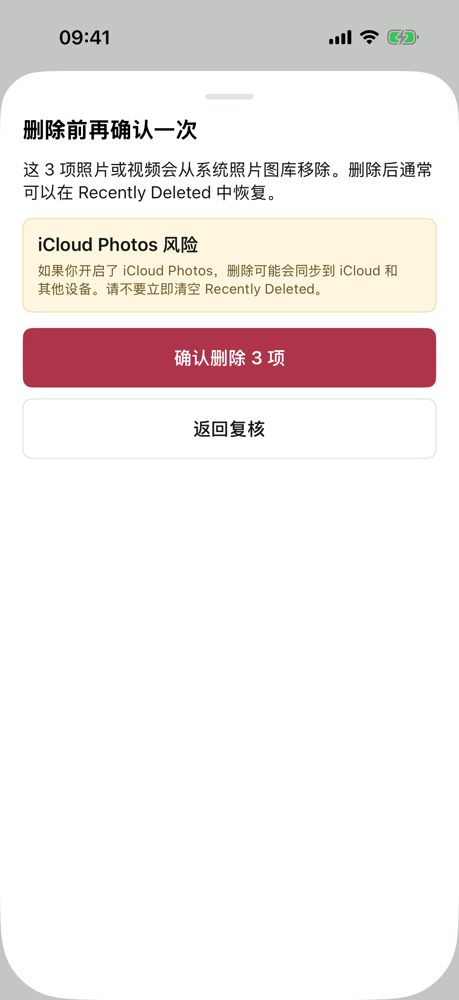
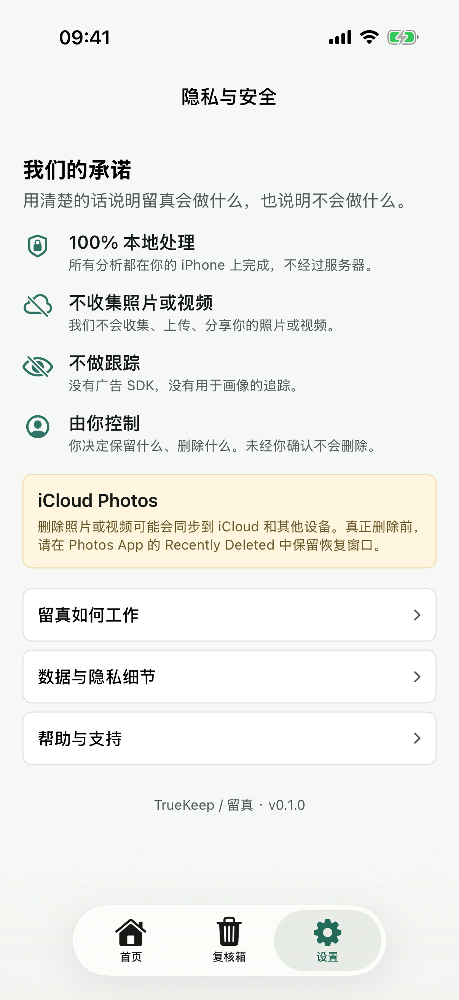
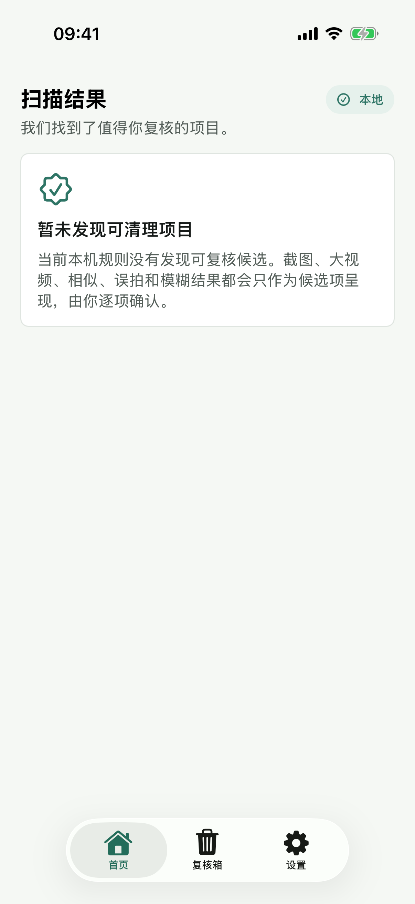

# 09 当前产品动线与截图

本文档用于说明当前 iOS MVP 的实际使用动线，并配套当前可用截图。主线不是“一键清理”，而是：

> 建立信任 -> 请求权限 -> 本地扫描 -> 按任务复核 -> 加入复核箱 -> 删除前二次确认。

截图来源：

- 主截图集：`iOS/TrueKeep/MarketingScreenshots/2026-06-13-1811-photo-video-copy/`
- 扫描状态补图：`03-scan-completed-limited.png`，使用 `-TrueKeepUITestLimitedCompletedScan` 启动参数在 iPhone 17 模拟器上补拍。

## 主线动线

### 1. 欢迎 / 信任首屏

用户先看到产品名、隐私承诺和删除前复核承诺。这一屏不触发系统权限弹窗。

用户动作：

- 点 `继续` 进入照片权限说明。
- 点 `了解更多` 进入隐私与安全页。

### 2. 照片权限说明

系统权限弹窗前先解释为什么需要访问照片和视频，并明确不会上传、不会自动删除。

用户动作：

- 点 `允许访问照片` 后触发系统 Photos 授权。
- 点 `暂不` 返回欢迎页。

### 3. 本地扫描进度 / 扫描完成

授权后进入本地扫描。Full Access 和 Limited Access 都可以扫描；Limited Access 会显示结果可能不完整的提示。

当前真实扫描覆盖：

- 截图和聊天截图。
- 占空间的大视频。
- 低置信度视觉候选：相似、误拍、模糊。

用户动作：

- 扫描完成后点 `查看结果` 进入首页。
- 可以点 `重新扫描` 重新开始。

### 4. 清理结果首页

结果按用户能理解的任务组织，而不是按技术类别堆列表。底部 Tab 从这里开始出现：`首页`、`复核箱`、`设置`。

用户动作：

- 点任一任务卡进入逐组复核。
- 可从底部 Tab 进入复核箱或隐私与安全页。

### 5. 逐组复核

用户看到候选缩略图、预计释放空间和标记理由。推荐保留项默认不可加入删除选择，低置信候选需要用户主动确认。

用户动作：

- 点缩略图切换是否加入删除选择。
- 点 `复核本组全部` 可快速选择本组候选。
- 点 `加入复核箱` 后进入复核箱。

### 6. 复核箱

复核箱是删除前缓冲区，不是已删除列表。页面明确提示 `尚未删除任何内容`。

用户动作：

- 点缩略图切换最终删除选择。
- 点 `恢复选中` 将项目移出复核箱。
- 点 `删除选中` 打开最终确认弹层。

### 7. 删除前二次确认

最终确认前明确说明照片或视频会从系统照片图库移除，并提示 iCloud Photos 同步风险与 Recently Deleted 恢复窗口。

用户动作：

- 点 `确认删除` 才执行 Photos 删除请求。
- 点 `返回复核` 回到复核箱。

## 重要分支状态

### 隐私与安全页

入口来自欢迎页 `了解更多` 或扫描结果后的 `设置` Tab。这里解释本地处理、无上传、无跟踪、用户控制，以及 iCloud Photos 风险。

### 默认空结果

默认真实扫描路径不会回退到样例数据。如果当前可访问照片范围内没有候选，会显示空结果状态。

## 产品判断

这条动线的核心不是释放空间最大化，而是降低授权阻力和误删恐惧：

- 权限前先建立信任。
- 扫描只产出候选，不直接删除。
- 首页按任务组织，降低理解成本。
- 逐组复核展示理由和推荐保留项。
- 复核箱作为删除缓冲。
- 删除前单独强调 iCloud Photos 和 Recently Deleted。
