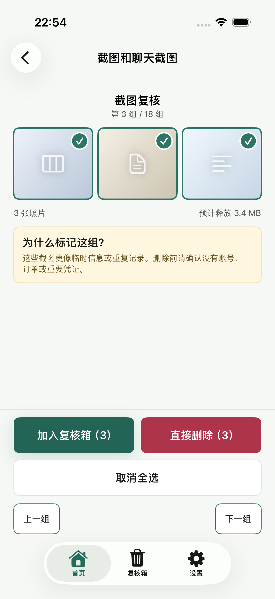
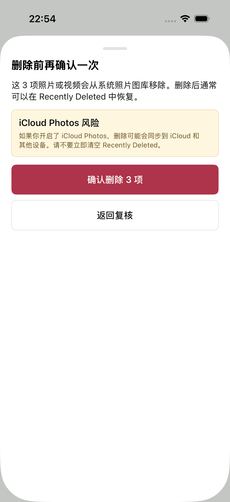
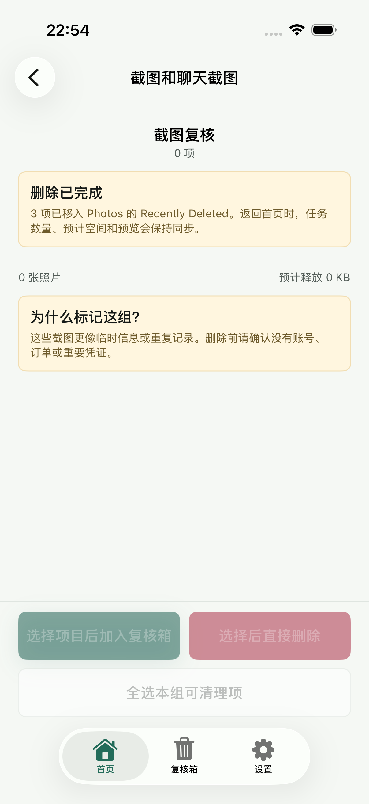
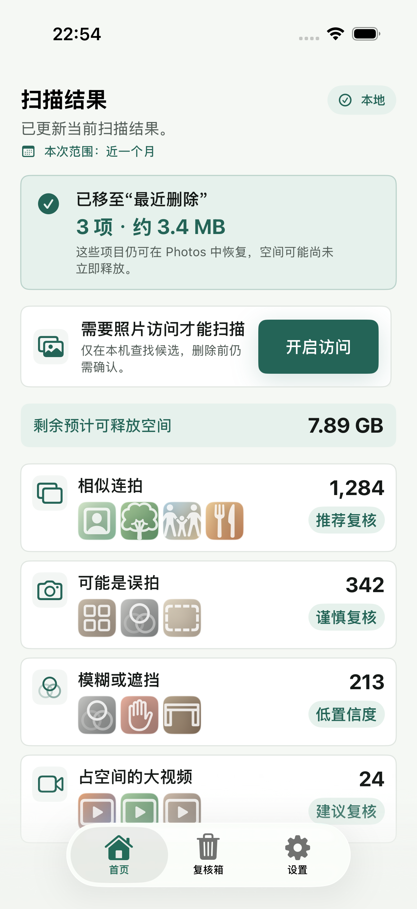
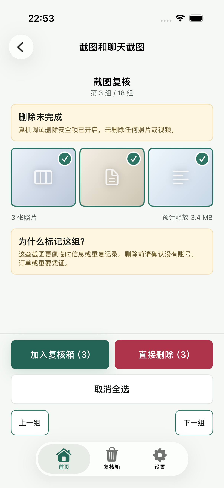

# 直接删除 E2E 证据

- 最新验证日期：2026-08-23
- 基线：`origin/dev@af9597a` 加直接删除变更
- 环境：Xcode 26.5，iPhone 17 Pro 模拟器，iOS 26.5（23F77）
- 结果：127/127 通过（96 个单元测试、31 个 UI 测试），0 失败，0 跳过
- 聚焦状态测试：22/22 通过
- 结果包：`/tmp/TrueKeepDirectDeleteE2E-20260823-final.xcresult`
- 删除安全：UI 测试使用 `-TrueKeepDisablePhotoDeletion`；成功路径为仅 DEBUG 可用的结果模拟，没有删除系统照片。

本功能关键 UI 测试：

- `testCriticalScreensPassAccessibilityAudit()`
- `testDirectDeleteFailurePreservesReviewCandidatesAndSelection()`
- `testDirectDeleteShowsBusyStateAndRefreshesHomeTaskAfterSuccess()`

## 必要截图

| 阶段 | 截图 |
| --- | --- |
| 直接删除与加入复核箱同层级，右侧边缘点击可触发 |  |
| 删除前二次确认与 iCloud 提示 |  |
| 删除中局部 loading，确认与取消不可重复触发 |  |
| 成功后当前组清空，空间归零，整组复核禁用 |  |
| 返回首页后来源任务同步移除 |  |
| 删除失败后候选与选择保留，可重试 |  |

截图已使用最新远端整合后的完整回归结果刷新。视觉检查未发现文字裁切或控件重叠；首页只移除来源任务，其他任务计数保持不变。无障碍字号下，两个主操作改为纵向全宽排列，并通过系统无障碍审计。
