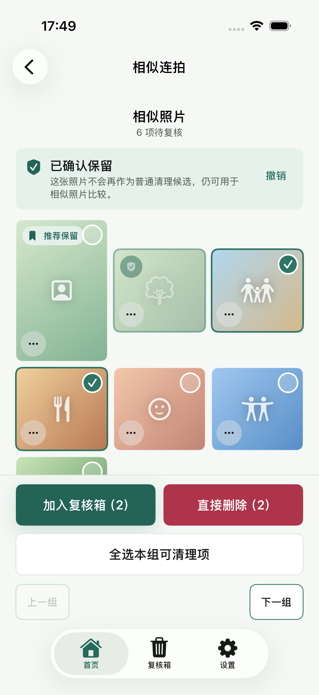
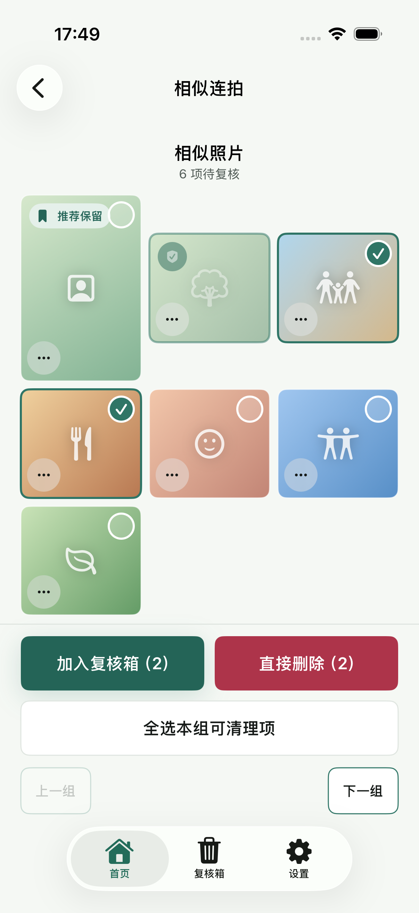
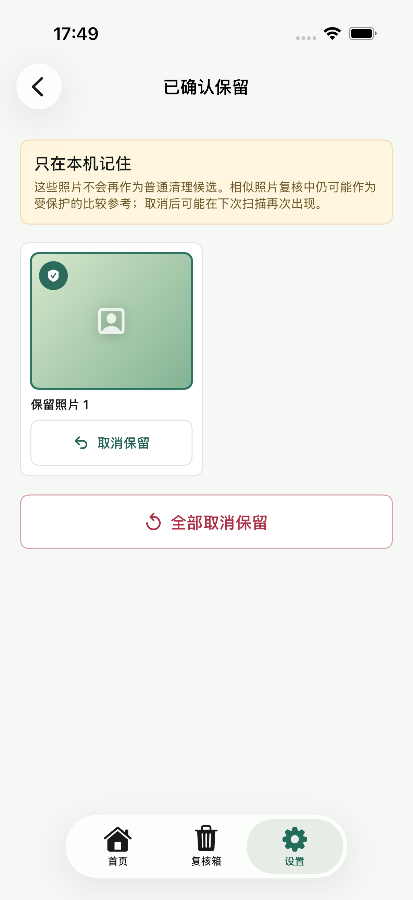
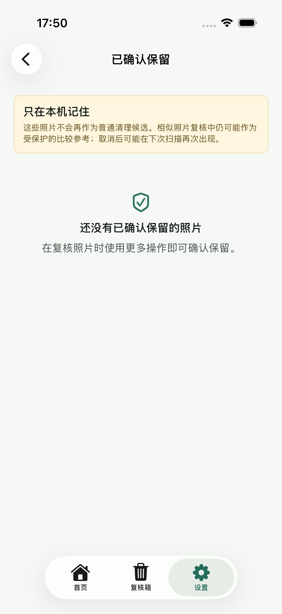

# 已确认保留 E2E 证据

- 验证日期：2026-08-25
- 环境：Xcode 26.5，iPhone 17 Pro 模拟器，iOS 26.5（23F77）
- 聚焦单元测试：90/90 通过，0 失败
- UI E2E：`testConfirmedKeepPersistsAcrossRelaunchAndCanBeManaged`，1/1 通过
- 结果包：`/tmp/TrueKeepConfirmedKeepsE2E-20260825-2.xcresult`
- 删除安全：UI 测试显式使用 `-TrueKeepDisablePhotoDeletion`，没有删除系统照片。

## 必要截图

| 阶段 | 截图 |
| --- | --- |
| 复核页确认保留、移出删除选择并提供撤销 |  |
| 冷启动后仍保留保护状态且计数不含保护项 |  |
| 设置页查看并逐项取消已确认保留 |  |
| 取消后显示空状态 |  |

截图由 XCUITest 使用 `XCTAttachment` 和 `keepAlways` 生成。最终设置管理页通过系统可访问性审计；目检未发现文字裁切、控件重叠或点击区域不足。
